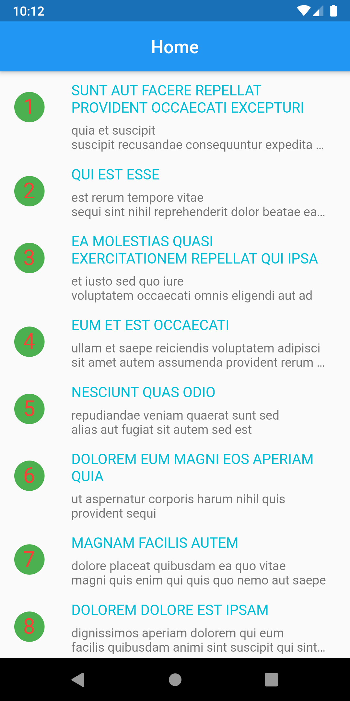
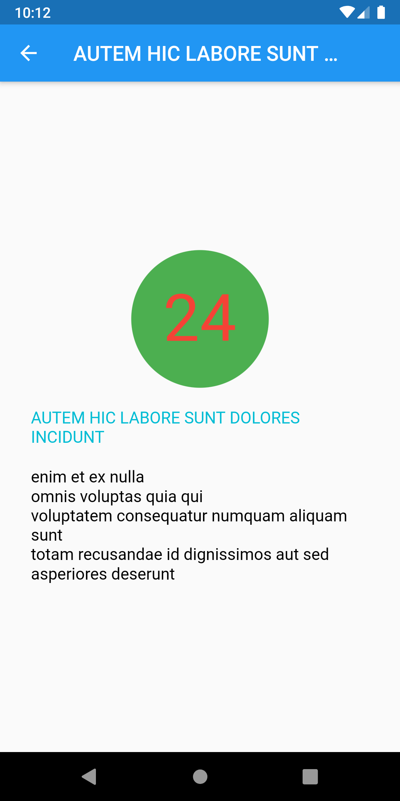

# Flutter Clean Architecture

In this project, I tried to implement the clean architecture in Flutter. To achieve clean architecture I use following libraries

#### State Management: Getx

#### Dependency Injection: Injectable + Getx

#### Networking: DIO

#### Logger: Fimber

#### Others: Connectivity

In this project, Business logic is completely separated from UI

## Project Structure

- controller
  - helper
    - data_status.dart
  - home_controller.dart
- di
  - config_inject_config.dart
  - config_inject.dart
- repo
  - api
    - home_api.dart
  - helper
    - response_helper.dart
  - layer
    - api_layer.dart
  - network_config.dart
  - webserver.dart
- ui
  - home
    - home_page.dart
    - home_page_helper.dart
  - details_page.dart
- utils
  - Logger.dart
- main.dart
- my_env.dart

## UI

#### Disclaimer: This project is not focused on UI

| Main Page         | Details Page         |
| ----------------- | -------------------- |
|  |  |

